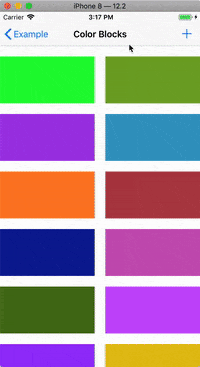
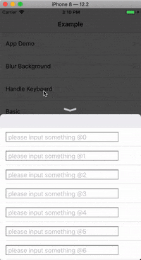
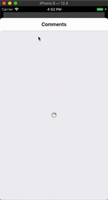

# HWPanModal 👍
<p style="align: left">
    <a href="https://cocoapods.org/pods/HWPanModal">
       
    </a>
    <a href="https://cocoapods.org/pods/HWPanModal">
       
    </a>
    <a href="https://cocoapods.org/pods/HWPanModal">
       
    </a>
    <a href="https://cocoapods.org/pods/HWPanModal">
       
    </a>
    <a href="https://travis-ci.org/HeathWang/HWPanModal">
       
    </a>
    <a href="https://codebeat.co/projects/github-com-heathwang-hwpanmodal-master">
        
    </a>
</p>


HWPanModal 用于从底部弹出控制器（UIViewController），并用拖拽手势来关闭控制器。提供了自定义视图大小和位置，高度自定义弹出视图的各个属性。

APP中常见的从底部弹出视图，可以通过该框架快速实现，只需专注于相应的视图编写。常规热门app的UI示例：
1. 知乎APP的查看评论
2. 抖音的评论查看
3. 微信，网易音乐等app弹出分享
4. 嘀嗒出行行程进行页（地图上的浮层view效果）
5. iOS13 默认模态(present)效果
6. And more...

## 特别感谢

Special Thanks to JetBrains! I use AppCode IDE to develop my open source project.
<p style="align: left">
    <a href="https://www.jetbrains.com/?from=HWPanModal">
       
    </a>
</p>

## 截图

<div style="text-align: center">
    <table>
        <tr>
            <th>Basic</th>
            <th>Blur background</th>
            <th>Keyboard handle</th>
            <th>App demo</th>          
        </tr>
        <tr>
            <td style="text-align: center">
            
            </td>
            <td style="text-align: center">
            
            </td>
            <td style="text-align: center">
            
            </td>
            <td style="text-align: center">
            
            </td>
        </tr>
    </table>
</div>

## 功能
1. 支持任意类型的 `UIViewController`
2. 支持继承自 `HWPanModalContentView` 的view
3. 平滑的转场动画
4. 支持2种类型的手势dismiss视图
    1. 上下方向拖动关闭视图。
    2. 侧滑关闭视图，支持全屏侧滑。
5. 支持为presenting VC编写自定义动画。
6. 支持配置动画时间，动画options，弹性spring值
7. 支持配置背景alpha，或者高斯模糊背景。注意：动态调整模糊效果仅工作于iOS9.0+。
8. 支持显示隐藏指示器，修改圆角
9. 自动处理键盘弹出消失事件。
10. 自定义指示器indicator view。
11. 事件可以穿透到下层presenting VC。
12. 可配置presented content 阴影。

更多配置信息请参阅 [_HWPanModalPresentable.h_](https://github.com/HeathWang/HWPanModal/blob/master/Sources/Presentable/HWPanModalPresentable.h) 声明。

## 特别注意

1. 任何情况下，内部嵌套scrollable（UIScrollView，UITableView，UIWebView，UICollectionView），如果scrollable的contentSize变化了，务必调用`- (void)hw_panModalSetNeedsLayoutUpdate`刷新UI！！！
2. 如果需要弹出浮层后push到下一层，使用`HWPanModalContentView`或者present vc用navigation 包一层。
3. 请仔细阅读md，编译run示例代码，95%的功能在示例中都有展示，不要什么都不看就来问问题！！！


### 支持UIViewController和继承自HWPanModalContentView弹出视图

从0.6.0版本后, 该框架支持使用 `HWPanModalContentView` 从底部弹出视图, 即实现了present ViewController同样的交互和动画。

不同点是 `HWPanModalContentView` 只是一个view视图, 通过添加一些动画实现了原本的功能。不像present ViewController的模式，你可以获得controller的整个生命周期，并且可以使用navigation栈来push VC。

`HWPanModalContentView` 目前的限制:
* 不支持转屏。
* 不支持屏幕边缘横向拖拽来dismiss。
* 不支持自定义presenting VC动画。（因为是view，没有presenting VC）

    
## 适配
**iOS 8.0+**, support Objective-C & Swift.

## 安装

### [CocoaPods](https://guides.cocoapods.org/using/using-cocoapods.html)

```ruby
pod 'HWPanModal', '~> 0.9.4'
```

## 如何使用

### 如何从底部弹出控制器
只需要视图控制器适配 `HWPanModalPresentable` 协议即可. 默认情况下，不用重写适配的各个方法，如果需要自定义，请实现协议方法。

更多的自定义UI配置，请参见`HWPanModalPresentable`协议中每个方法的说明。

```Objective-C
#import <HWPanModal/HWPanModal.h>
@interface HWBaseViewController () <HWPanModalPresentable>

@end

@implementation HWBaseViewController

- (void)viewDidLoad {
    [super viewDidLoad];
    // Do any additional setup after loading the view.
}

#pragma mark - HWPanModalPresentable
- (PanModalHeight)longFormHeight {
    return PanModalHeightMake(PanModalHeightTypeMaxTopInset, 44);
}
@end
```

弹出控制器：

```Objective-C
#import <HWPanModal/HWPanModal.h>
[self presentPanModal:[HWBaseViewController new]];
```

就是这么简单。

### 如何主动更新控制器UI
请查阅 `UIViewController+Presentation.h`，里面有详细说明。
* Change the state between short and long form. call `- (void)hw_panModalTransitionTo:(PresentationState)state;`
* Change ScrollView ContentOffset. call `- (void)hw_panModalSetContentOffset:(CGPoint)offset;`
* Reload layout. call `- (void)hw_panModalSetNeedsLayoutUpdate;`
    * 注意：如果scrollable view的contentSize改变了，你必须调用改reload方法来更新UI。

### 自定义presenting VC动画编写

1. Create object conforms `HWPresentingViewControllerAnimatedTransitioning` .

    ```Objective-C
    
    @interface HWMyCustomAnimation : NSObject <HWPresentingViewControllerAnimatedTransitioning>
    
    @end
    
    @implementation HWMyCustomAnimation
    
    
    - (void)presentAnimateTransition:(id<HWPresentingViewControllerContextTransitioning>)transitionContext {
        NSTimeInterval duration = [transitionContext transitionDuration];
        UIViewController *fromVC = [transitionContext viewControllerForKey:UITransitionContextFromViewControllerKey];
        // replace it.
        [UIView animateWithDuration:duration delay:0 usingSpringWithDamping:0.8 initialSpringVelocity:0 options:UIViewAnimationOptionCurveEaseInOut animations:^{
            fromVC.view.transform = CGAffineTransformMakeScale(0.95, 0.95);
        } completion:^(BOOL finished) {
            
        }];
    }
    
    - (void)dismissAnimateTransition:(id<HWPresentingViewControllerContextTransitioning>)transitionContext {
        NSTimeInterval duration = [transitionContext transitionDuration];
        UIViewController *toVC = [transitionContext viewControllerForKey:UITransitionContextToViewControllerKey];
        // replace it.
        [UIView animateWithDuration:duration animations:^{
            toVC.view.transform = CGAffineTransformIdentity;
        }];
    }
    
    @end
    ```
1. Overwrite below two method.

    ```Objective-C
    - (PresentingViewControllerAnimationStyle)presentingVCAnimationStyle {
        return PresentingViewControllerAnimationStyleCustom;
    }
    
    - (id<HWPresentingViewControllerAnimatedTransitioning>)customPresentingVCAnimation {
        return self.customAnimation;
    }
    
    - (HWMyCustomAnimation *)customAnimation {
        if (!_customAnimation) {
            _customAnimation = [HWMyCustomAnimation new];
        }
        return _customAnimation;
    }
    ```
    
### 自定义指示器indicator view

You just need to create your own UIView, then adopt `HWPanModalIndicatorProtocol`.

In your presented controller, return it:

```Objective-C
- (nullable UIView <HWPanModalIndicatorProtocol> *)customIndicatorView {
    HWTextIndicatorView *textIndicatorView = [HWTextIndicatorView new];
    return textIndicatorView;
}
```

Here is `HWTextIndicatorView` code:

```Objective-C
@interface HWTextIndicatorView : UIView <HWPanModalIndicatorProtocol>

@end

@interface HWTextIndicatorView ()
@property (nonatomic, strong) UILabel *stateLabel;
@end

@implementation HWTextIndicatorView

- (instancetype)initWithFrame:(CGRect)frame {
    self = [super initWithFrame:frame];
    if (self) {
        // init the _stateLabel
        [self addSubview:_stateLabel];
    }
    return self;
}


- (void)didChangeToState:(HWIndicatorState)state {
    switch (state) {
        case HWIndicatorStateNormal: {
            self.stateLabel.text = @"Please pull down to dismiss";
            self.stateLabel.textColor = [UIColor whiteColor];
        }
            break;
        case HWIndicatorStatePullDown: {
            self.stateLabel.text = @"Keep pull down to dismiss";
            self.stateLabel.textColor = [UIColor colorWithRed:1.000 green:0.200 blue:0.000 alpha:1.00];
        }
            break;
    }
}

- (CGSize)indicatorSize {
    return CGSizeMake(200, 18);
}

- (void)setupSubviews {
    self.stateLabel.frame = self.bounds;
}

@end

```   

### 如何使用HWPanModalContentView

你必须继承自 `HWPanModalContentView`. `HWPanModalContentView` 适配 `HWPanModalPresentable` 协议，就像你可用该协议来present一样。

```Objective-C
@interface HWSimplePanModalView : HWPanModalContentView

@end

@implementation HWSimplePanModalView

- (instancetype)initWithFrame:(CGRect)frame {
    self = [super initWithFrame:frame];
    if (self) {
        // add view and layout.
    }
    
    return self;
}

// present it.
HWSimplePanModalView *simplePanModalView = [HWSimplePanModalView new];
[simplePanModalView presentInView:nil];
```
 

## 例子

1. 克隆项目
2. 然后执行 `pod install`
3. 打开 HWPanModal.xcworkspace, 选择OC或者Swift项目运行

###### 我分别编写了纯`Objective-C` & `Swift`例子，基本涵盖了该framework的所有API使用。

## 联系我

Heath Wang
yishu.jay@gmail.com

## WX

<p style="align: left">
    <a>
       
    </a>
</p>

## License

<b>HWPanModal</b> is released under a MIT License. See LICENSE file for details.


